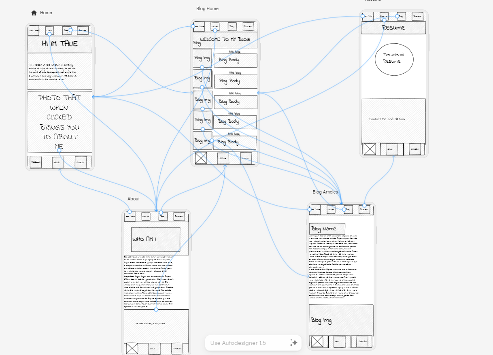

# Portfolio Overview

The aim of the portfolio, in line with the brief, is to entice potential employers into reaching out and contacting. The site itself is used in a way to learn about me as a potential employee in a easy to digest manor that can be accessed using a phone, tablet or a desktop.

## Global Functionality and Features

Overall, the site has many features implented into the website. It includes different ways to navigate the website in an intuitive way, different to the usual nav bar approach. While the website was built for the mobile first approach it can be viewed on tablet and desktop as well without a loss to usability. The site uses titles which are made to pop using a bright red. This colour is used throughout the site to show the title/purpose of each page. I used a dark blue as the background color of the main body throughout every page, while also using a lighter blue to indicate the main text component of each.

### Header

The headers' main component is the nav bar that allows for easy navigation through the website. The main difference between this and a normal nav bar is the use of buttons instead of hyperlink text. The decision to use buttons instead of text was because I believe buttons are a much easier navigation tool when using touch screen devices such as mobiles and tablets. The nav bar itself includes ways to get to the home, about, blog, and contact pages. The header itself has breakpoints that change how the header looks when the screen is changed to the desktop and tablet view widths. A background image was used over a color to give the site a bit better of a flow, giving the user the impression that the site is more conjoined rather then just a bunch of separate divs. The buttons themselves are organised using flexbox.

Here is the code:

```html   
<!-- Header Component -->
    <header>
        <nav id="navitems">
            <a href="../index.html">
                <button class="button"><i class="fa-solid fa-house"></i></button>
             </a>

            <a href="./about.html">
                <button class="button">About</button>
            </a>

            <a href="./blog.html">
                 <button class="button">Blog</button>
            </a>

            <a href="./contact.html">
                <button class="button">Contact</button>
            </a>     
        </nav>
    </header> 
``` 

### Footer

The Footer includes graphical components used to redirect the user to Facebook, Github, and Linkedin. The icons used for this footer scale in size when hovered this allows for the site to give feedback to the user and allows for a better user experience. The icons are organised using flexbox.
 
 ```html
   <!-- Footer Component -->
    <footer>
        <div class="socialmedia">
            <a href="https://www.facebook.com/taliesin.hodge/" target="_blank">
                <i id="facebook" class="fa-brands fa-facebook"></i>
            </a>
            <a href="https://github.com/DefineTal" target="_blank">
                <i id="github" class="fa-brands fa-github-alt"></i>
            </a>
            <a href="https://www.linkedin.com/in/talie-hodge-0548b42a0/" target="_blank">
                <i id="linkedin" class="fa-brands fa-linkedin"></i>
            </a>
        </div>
    </footer>

 ```

## Home Page Function and Features
The home page functions as an introductory page that gives the user a brief introduction on who I am. The title is located in the middle for each of the breakpoints to grab the users attention. The graphical component in the home page is a picture of me which when hovered shows the text "Click To Learn About Me". When clicked it will redirect the user to the about page. This gives the user a way to navigate through the page without using the navbar in the header component while in toe gives the user feedback when interacting with the website.

Graphical Component HTML Code:

```html
    <div class="homeimagediv">
            <a href="./Pages/about.html">
                
                <div class="overlay">Click To Learn About Me</div>
            </a>
    </div>

```
Graphical Component SCSS Code:

```css
        .homeimagediv{
           margin: auto;

            #homeimage{
                width: 350px;
                height: 290px;
            }
            .overlay{
                margin: auto;
                margin-top: 414px;
                font-family: 'Inter Tight', sans-serif;
                font-size: 32px;
                text-align: center;
                position: fixed;
                top: 0;
                bottom: 0;
                left: 0;
                right: 0;
                height: 290px;
                width: 350px;
                opacity: 0;
                transition: 0.9s;
                background-color: #008CBA;
                &:hover{
                    opacity: 1;
                }
            }
        }
```
## About Page Functions and Features
The about page serves as a way to learn indepth about me more so then the home page.
While fairly similiar to the home page, the about page uses a circle as the title holder. It also uses a different graphical component; an arrow, as a way to redirect the user to the blog page.

Arrow Graphical Component HTML Code:

```html
        <div class="toblog">
            <div>To learn about my journey so far </div>
            <div>Click Here!</div>
            <a href="./blog.html">
            <i id="arrow" class="fa-sharp fa-solid fa-arrow-right fa-5x" style="color: #e63946;"></i>
            </a>
        </div>
```

Arrow Graphical Component SCSS Code:

```css
    .toblog{
        text-align: center;     
        color: $textcolor;
        #arrow{
            transition: 1s;
            &:hover{
                scale: 1.2;
            }
        }
     }
```

## Blog Home Page Functions and Features
The blog page will, in the future, serve as a way to inform others on my journey in developing my skills. It does this by having a list of blog posts, showing the publish date and the title, shown in a column that when clicked redirect the user to a separate page for the interacted post. The posts themselves are positioned using flex box and the flex-direction: Column-Reverse to sort them so that the oldest is shown at the bottom and allows for easier additions in the future. When hovering these blog cards, a box shadow will apear around the card to give the user feedback and to show that the card can be clicked. Each post has its own dedicated image located on the left of the card.
 
 Blog Card HTML Code:

 ```html
        <a href="./blogpages/blogpage2.html">
            <article class="blogcard">
                <section> <h1 class="blogtitle">Mobile First</h1>
                    
                </section>
                <h4> 21/01/2020</h4>
            </article>
        </a>
 ```
Blog Card SCSS Code:

```css
.blogcard{
            font-family: 'Inter Tight', sans-serif;
            background-color: $textbgcolor;
            text-align: center;
            height: 85px;
            border: 1px solid black;
            &:hover{
                box-shadow: 0px 0px 20px black;
            }
           
            h4{
                display: inline-block;
                color: $textcolor;
                margin-left: 20px;
                font-size: 14px;
            }
            .blogtitle{
                float: right;
                color: $textcolor;
                margin-right: 70px;
                font-size: 14px;
            }
            .blogimage{
                float: left;
                width: 85px;
                height: 85px;
            }
        }
```

## Blog Post Pages Functions and Features
The blog post pages aim is to go into greater detail on the topic specified in the blog home page. The page itself is extremely basic and doesnt add anything that the previous sites have used. It includes a Title Block and Main text block which like previouse pages are highlighted with their respective colors.

## Resume & Contact Page Functions and Features
The contact page is used for people looking to see my resume or people trying to contact me. The main elements of this page that differ from previous is a form element with fillable fields and a download resume text surrounded by a circle. The circle itself will enlarge when hovered over for user feedback and interaction. The form element allows for user interaction within the fields.

Circle HTML Code:
 ```html
     <div class="circle">
        <a href="../Files/Resume.pdf" download="Resume.pdf">To See Resume Click Here!</a>
    </div>

 ```
Circle SCSS Code:

 ```css
      .circle {
        font-family: 'Inter Tight', sans-serif;
        margin: auto;
        width: 200px;
        height: 150px;
        line-height: 150px;
        border-radius: 50%;
        font-size: 15px;
        text-align: center;
        background: $accentcolor;
        transition: 1s;
        &:hover{
            box-shadow: 0px 0px 20px 0px $accentcolor;
            scale: 1.1;
        }
        a{
            color: $textcolor;
        }
    }
 ```

## SiteMap:


The above sitemap shows how each of my element of my site interacts and where it will send you when interacted with.

## Breakpoints Used:
- Mobile 360*800 (Default Large Android - given from Figma)
- Tablet 834*1194 (iPad Pro 11")
- Desktop 1440*1024 (Figmas Desktop Frame)

## Tech Stack
- Figma
- Uizard
- CSS
- SCSS
- HTML
- Netlify

## Links
### Github Repository
 - https://github.com/DefineTal/TalPortfolioA1

### Published Website
- https://talie-portfolio.netlify.app/

### Presentation Video
- https://www.youtube.com/watch?v=Oo1v7WxjI0I

### SiteMap:
- https://app.uizard.io/p/aebfd804

### Wireframes:
- https://www.figma.com/file/EpkwrtQ4H2eITsLXmtIvfM/Home---PH?type=design&node-id=0%3A1&mode=design&t=8CWKWe6Nfma0lCut-1